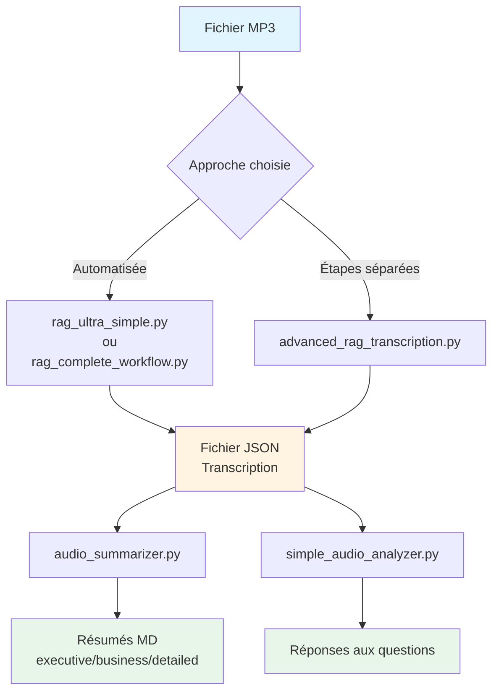

# Guide : Transcription et Résumé de Fichiers Audio de Conversation

## 🚀 Démarrage Rapide - Comment Lancer le Traitement

### Étape 1 : Préparer votre fichier audio

Placez votre fichier audio dans le répertoire `input/` :

```bash
# Créer le répertoire si nécessaire
mkdir -p input

# Copier votre fichier audio
cp /chemin/vers/votre_fichier.mp3 input/
# ou
cp /chemin/vers/votre_fichier.m4a input/
```

### Étape 2 : Lancer le traitement

**Méthode la plus simple (recommandée)** :

```bash
# Pour un fichier MP3
uv run python rag_ultra_simple.py input/votre_fichier.mp3

# Pour un fichier M4A, WAV, FLAC, etc.
uv run python rag_ultra_simple.py input/votre_fichier.m4a
```

**Avec plus d'options** :

```bash
# Avec mots-clés personnalisés et résumés multiples
uv run python rag_complete_workflow.py input/votre_fichier.mp3 \
  --keywords "Mots,Clés,Pertinents" \
  --summaries executive business detailed
```

### Étape 3 : Récupérer les résultats

Les fichiers générés se trouvent dans `output/` :

```bash
# Voir les transcriptions
ls -lh output/transcriptions/

# Voir les résumés
ls -lh output/summaries/
```

**Fichiers générés** :
- `output/transcriptions/votre_fichier_advanced_rag_*.json` - Transcription complète
- `output/summaries/resume_executif.md` - Résumé exécutif
- `output/summaries/resume_business.md` - Résumé business (si demandé)
- `output/summaries/resume_detaille.md` - Résumé détaillé (si demandé)

### Exemple Complet

```bash
# 1. Placer le fichier
cp mon_enregistrement.m4a input/

# 2. Lancer le traitement
uv run python rag_ultra_simple.py input/mon_enregistrement.m4a

# 3. Consulter les résultats
cat output/summaries/resume_executif.md
```

---

## Vue d'ensemble

Ce projet TakeNoteAI permet de transformer un fichier audio de conversation (MP3, M4A, WAV, FLAC, AAC, OGG) en transcription JSON et en résumés automatiques. Il existe **deux approches principales** :

1. **Approche automatisée (recommandée)** : Un seul script fait tout
2. **Approche en étapes** : Contrôle manuel de chaque étape

### 📁 Structure des Répertoires (Résumé)

- **Fichiers sources (entrée)** : Placez vos fichiers audio dans `input/`
- **Fichiers générés (sortie)** : Tous les résultats sont dans `output/`
  - `output/transcriptions/` → Fichiers JSON de transcription
  - `output/summaries/` → Résumés en Markdown
  - `output/keywords/` → Mots-clés extraits
  - `output/workflows/` → Résultats de workflows

*Voir la section détaillée [Structure des Répertoires](#structure-des-répertoires-et-emplacement-des-fichiers) pour plus d'informations.*

### 🎵 Formats Audio Supportés

Le projet supporte plusieurs formats audio :
- **MP3** (recommandé) - Utilisation directe
- **M4A** - Utilisation directe ou conversion
- **WAV** - Utilisation directe ou conversion
- **FLAC** - Utilisation directe ou conversion
- **AAC** - Utilisation directe ou conversion
- **OGG** - Utilisation directe ou conversion

*Voir la section [Traitement des Fichiers Non-MP3](#traitement-des-fichiers-non-mp3) pour plus de détails.*

## Installation et Gestion des Dépendances avec uv

### Installation de uv

**uv** est un gestionnaire de paquets Python moderne et rapide. Il est recommandé pour ce projet.

#### Sur macOS (via Homebrew)
```bash
brew install uv
```

#### Installation universelle (script officiel)
```bash
curl -LsSf https://astral.sh/uv/install.sh | sh
```

### Configuration du projet avec uv

Si le projet n'est pas encore configuré avec uv :

```bash
# 1. Initialiser le projet (crée pyproject.toml si nécessaire)
uv init

# 2. Installer les dépendances principales
uv add openai-whisper ffmpeg-python torch torchaudio chromadb sentence-transformers keybert spacy psutil

# 3. Installer les dépendances RAG avancées (optionnel)
uv add transformers speechbrain

# 4. Verrouiller les versions (génère uv.lock)
uv lock

# 5. Synchroniser l'environnement
uv sync
```

### Utilisation de uv pour exécuter les scripts

**Remplacez `python3` par `uv run python`** dans toutes les commandes :

```bash
# Au lieu de : python3 rag_ultra_simple.py audio.mp3
uv run python rag_ultra_simple.py audio.mp3

# Au lieu de : python3 advanced_rag_transcription.py audio.mp3
uv run python advanced_rag_transcription.py audio.mp3
```

### Avantages de uv

- ✅ **Installation rapide** : Plus rapide que pip pour installer les dépendances
- ✅ **Gestion des versions** : Verrouillage automatique avec `uv.lock`
- ✅ **Environnements isolés** : Gestion automatique des environnements virtuels
- ✅ **Compatibilité** : Compatible avec `pyproject.toml` et `requirements.txt`

### Commandes uv utiles

```bash
# Ajouter une nouvelle dépendance
uv add nom-du-paquet

# Ajouter une dépendance de développement
uv add --dev pytest

# Mettre à jour toutes les dépendances
uv lock --upgrade

# Synchroniser l'environnement avec uv.lock
uv sync

# Lister les dépendances installées
uv pip list

# Exécuter un script avec l'environnement uv
uv run python script.py
```

## Approche 1 : Workflow Automatisé (Recommandé)

### Option A : Script Ultra-Simple (`rag_ultra_simple.py`)

**Usage quotidien le plus simple** - Transcription + Analyse + Résumé en une commande :

```bash
# Avec uv (recommandé)
uv run python rag_ultra_simple.py votre_conversation.mp3

# Ou avec python3 classique
python3 rag_ultra_simple.py votre_conversation.mp3
```

**Ce que ça fait automatiquement :**

1. ✅ Transcription RAG du MP3 → génère un fichier JSON
2. ✅ Analyse des risques identifiés
3. ✅ Génération d'un résumé exécutif

**Fichiers générés :**

- `output/transcriptions/votre_conversation_advanced_rag_*.json` (transcription complète)
- `output/summaries/resume_executif.md` (résumé exécutif)

### Option B : Script Complet (`rag_complete_workflow.py`)

**Workflow complet avec plus d'options** - Transcription + Mots-clés + Analyse + Résumés multiples :

```bash
# Utilisation basique
uv run python rag_complete_workflow.py votre_conversation.mp3

# Avec mots-clés personnalisés (améliore la transcription)
uv run python rag_complete_workflow.py votre_conversation.mp3 --keywords "Azure,Microsoft,Technologie"

# Avec types de résumés spécifiques
uv run python rag_complete_workflow.py votre_conversation.mp3 --summaries executive business detailed

# Configuration complète
uv run python rag_complete_workflow.py votre_conversation.mp3 \
  --keywords "Mots,Clés,Pertinents" \
  --summaries executive business \
  --top-keywords 30
```

**Ce que ça fait automatiquement :**

1. ✅ Transcription RAG avec mots-clés
2. ✅ Génération automatique de mots-clés
3. ✅ Analyse avec questions intelligentes
4. ✅ Génération de résumés (executive, business, detailed)

**Fichiers générés :**

- `output/transcriptions/votre_conversation_advanced_rag_*.json` (transcription)
- `output/keywords/keywords_generated_*.txt` (mots-clés extraits)
- `output/summaries/resume_executif.md` (résumé exécutif)
- `output/summaries/resume_business.md` (résumé business)
- `output/summaries/resume_detaille.md` (résumé détaillé)

## Approche 2 : Étapes Séparées (Contrôle Fin)

### Étape 1 : Transcription (OBLIGATOIRE)

**Générer le fichier JSON de transcription** :

```bash
# Avec uv (recommandé)
uv run python advanced_rag_transcription.py votre_conversation.mp3

# Ou avec python3 classique
python3 advanced_rag_transcription.py votre_conversation.mp3
```

**Résultat :** Fichier JSON généré dans `output/transcriptions/` ou le répertoire courant

- Format : `votre_conversation_advanced_rag_YYYYMMDD_HHMMSS.json`
- Contient : Transcription complète avec segments, timestamps, métadonnées

### Étape 2 : Génération de Résumés (OPTIONNEL)

Une fois le JSON généré, vous pouvez créer différents types de résumés :

```bash
# Résumé exécutif (concis, décisionnel)
uv run python audio_summarizer.py votre_conversation_advanced_rag_*.json --type executive

# Résumé business (orienté métier)
uv run python audio_summarizer.py votre_conversation_advanced_rag_*.json --type business

# Résumé détaillé (complet, technique)
uv run python audio_summarizer.py votre_conversation_advanced_rag_*.json --type detailed

# Tous les types de résumés
uv run python audio_summarizer.py votre_conversation_advanced_rag_*.json --type all
```

**Fichiers générés :**

- `output/summaries/resume_executif.md`
- `output/summaries/resume_business.md`
- `output/summaries/resume_detaille.md`

### Étape 3 : Analyse avec Questions (OPTIONNEL)

Poser des questions spécifiques sur la transcription :

```bash
uv run python simple_audio_analyzer.py votre_conversation_advanced_rag_*.json \
  --question "Quels sont les risques identifiés ?"

uv run python simple_audio_analyzer.py votre_conversation_advanced_rag_*.json \
  --question "Quelles sont les actions prioritaires ?"
```

## Traitement des Fichiers Non-MP3

### Formats Supportés

Les scripts RAG acceptent directement plusieurs formats audio :
- ✅ **MP3** - Format recommandé, utilisation directe
- ✅ **M4A** - Format Apple, utilisation directe
- ✅ **WAV** - Format non compressé, utilisation directe
- ✅ **FLAC** - Format lossless, utilisation directe
- ✅ **AAC** - Format compressé, utilisation directe
- ✅ **OGG** - Format open source, utilisation directe

### Option 1 : Utilisation Directe (Recommandé)

**Les scripts RAG acceptent directement tous ces formats** - pas besoin de conversion préalable :

```bash
# Fichier M4A
uv run python rag_ultra_simple.py input/votre_conversation.m4a

# Fichier WAV
uv run python rag_complete_workflow.py input/reunion.wav --keywords "Mots,Clés"

# Fichier FLAC
uv run python advanced_rag_transcription.py input/interview.flac
```

**Avantages** :
- ✅ Pas de conversion nécessaire
- ✅ Traitement direct et rapide
- ✅ Pas de perte de qualité supplémentaire

### Option 2 : Conversion Préalable en MP3

Si vous préférez convertir en MP3 avant le traitement (pour standardiser ou optimiser) :

#### Étape 1 : Conversion avec `audio_converter.py`

```bash
# Conversion basique (qualité haute par défaut)
uv run python audio_converter.py input/votre_conversation.m4a

# Conversion avec qualité spécifiée
uv run python audio_converter.py input/reunion.wav -q high
uv run python audio_converter.py input/interview.flac -q medium
uv run python audio_converter.py input/audio.aac -q low

# Spécifier le fichier de sortie
uv run python audio_converter.py input/votre_conversation.m4a -o input/converted.mp3
```

**Qualités disponibles** :
- `high` : 192kbps, 44.1kHz (recommandé pour qualité optimale)
- `medium` : 128kbps, 44.1kHz (bon compromis)
- `low` : 96kbps, 22kHz (rapide, qualité réduite)

**Résultat** : Fichier `*_converted.mp3` créé dans le même répertoire

#### Étape 2 : Traitement du fichier MP3 converti

```bash
# Utiliser le fichier converti
uv run python rag_ultra_simple.py input/votre_conversation_converted.mp3
```

### Comparaison des Approches

| Approche | Avantages | Inconvénients | Quand l'utiliser |
|----------|-----------|---------------|------------------|
| **Directe** | Rapide, pas de conversion, pas de perte | - | ✅ **Recommandé** pour tous les formats |
| **Conversion** | Standardisation MP3, optimisation possible | Temps supplémentaire, possible perte de qualité | Si vous avez besoin de fichiers MP3 standardisés |

### Exemples Pratiques

#### Exemple 1 : Fichier M4A (iPhone, Mac)

```bash
# Méthode directe (recommandée)
uv run python rag_ultra_simple.py input/enregistrement_iphone.m4a

# Méthode avec conversion
uv run python audio_converter.py input/enregistrement_iphone.m4a
uv run python rag_ultra_simple.py input/enregistrement_iphone_converted.mp3
```

#### Exemple 2 : Fichier WAV (enregistrement haute qualité)

```bash
# Méthode directe (recommandée)
uv run python rag_complete_workflow.py input/reunion_haute_qualite.wav \
  --keywords "Réunion,Projet,Équipe" \
  --summaries executive business
```

#### Exemple 3 : Fichier FLAC (lossless)

```bash
# Méthode directe (recommandée)
uv run python advanced_rag_transcription.py input/interview.flac
uv run python audio_summarizer.py output/transcriptions/interview_advanced_rag_*.json --type all
```

### Notes Importantes

1. **FFmpeg requis** : La conversion nécessite FFmpeg installé sur votre système
   ```bash
   # macOS
   brew install ffmpeg
   
   # Linux
   sudo apt install ffmpeg
   ```

2. **Qualité de conversion** : La conversion en MP3 peut légèrement réduire la qualité, mais les paramètres par défaut sont optimisés pour Whisper

3. **Taille des fichiers** : Les fichiers convertis en MP3 sont généralement plus petits que les originaux (sauf MP3 déjà)

4. **Traitement direct** : Les scripts RAG utilisent Whisper qui accepte nativement tous ces formats, donc la conversion n'est généralement pas nécessaire

## Structure des Répertoires et Emplacement des Fichiers

### 📁 Répertoire des Fichiers Sources (Entrée)

**Placez vos fichiers audio dans le répertoire `input/`** :

```
TakeNoteAI/
└── input/                    # 📥 FICHIERS SOURCES (à créer si nécessaire)
    ├── votre_conversation.mp3
    ├── reunion_equipe.m4a
    ├── interview.wav
    ├── enregistrement.flac
    └── ...
```

**Formats audio supportés** :
- `.mp3` (recommandé), `.m4a`, `.wav`, `.flac`, `.aac`, `.ogg`

*Tous ces formats peuvent être utilisés directement avec les scripts RAG. Voir [Traitement des Fichiers Non-MP3](#traitement-des-fichiers-non-mp3) pour plus de détails.*

**Comment utiliser** :
```bash
# Option 1 : Placer le fichier dans input/ puis utiliser juste le nom
uv run python rag_ultra_simple.py votre_conversation.mp3
# → Le script cherche automatiquement dans input/votre_conversation.mp3

# Option 2 : Utiliser le chemin complet
uv run python rag_ultra_simple.py input/votre_conversation.mp3

# Option 3 : Utiliser un fichier ailleurs (fallback)
uv run python rag_ultra_simple.py /chemin/vers/votre_conversation.mp3
```

### 📤 Répertoires des Fichiers de Sortie

**Tous les fichiers générés sont organisés dans `output/`** :

```
TakeNoteAI/
└── output/                    # 📤 FICHIERS DE SORTIE (créé automatiquement)
    ├── transcriptions/        # 📄 Fichiers JSON de transcription
    │   └── nom_advanced_rag_YYYYMMDD_HHMMSS.json
    ├── keywords/              # 🔤 Fichiers de mots-clés générés
    │   └── keywords_generated_*.txt
    ├── summaries/             # 📝 Résumés générés (Markdown)
    │   ├── resume_executif.md
    │   ├── resume_business.md
    │   └── resume_detaille.md
    ├── workflows/             # 🔄 Résultats de workflows complets
    │   └── workflow_results_*.json
    ├── analysis/              # 📊 Analyses et rapports
    ├── configs/               # ⚙️ Fichiers de configuration
    ├── benchmarks/            # ⚡ Résultats de benchmarks
    └── backups/               # 💾 Sauvegardes
```

### 📄 Détails des Fichiers Générés

#### Fichiers de Transcription

- **Emplacement** : `output/transcriptions/`
- **Format** : `nom_advanced_rag_YYYYMMDD_HHMMSS.json`
- **Contenu** :
  - Transcription complète avec segments
  - Timestamps pour chaque segment
  - Métadonnées (durée, langue, modèle utilisé)
  - Structure : `{"transcription": {"text": "...", "segments": [...]}, "metadata": {...}}`

#### Fichiers de Mots-clés

- **Emplacement** : `output/keywords/`
- **Format** : `keywords_generated_nom_*.txt`
- **Contenu** : Liste des mots-clés extraits automatiquement

#### Fichiers de Résumés

- **Emplacement** : `output/summaries/`
- **Résumé exécutif** : `resume_executif.md`
  - Vue d'ensemble concise, risques, actions prioritaires
- **Résumé business** : `resume_business.md`
  - Impact business, métriques, recommandations
- **Résumé détaillé** : `resume_detaille.md`
  - Transcription complète, segments détaillés, analyse approfondie

#### Fichiers de Workflows

- **Emplacement** : `output/workflows/`
- **Format** : `workflow_results_TIMESTAMP.json`
- **Contenu** : Métadonnées complètes du workflow (durées, résultats par étape)

### 🔧 Gestion des Répertoires

#### Créer la structure automatiquement

Les répertoires sont créés automatiquement lors de la première exécution. Vous pouvez aussi les créer manuellement :

```bash
# Créer le répertoire d'entrée
mkdir -p input

# La structure output/ est créée automatiquement par OutputManager
```

#### Vérifier les fichiers disponibles

```bash
# Lister les fichiers audio dans input/
ls -lh input/

# Vérifier les fichiers générés
ls -lh output/transcriptions/
ls -lh output/summaries/
```

#### Nettoyer les fichiers de sortie

```bash
# Nettoyer un répertoire spécifique (garde les 5 plus récents)
uv run python -c "from output_manager import OutputManager; OutputManager().clean_directory('transcriptions', keep_recent=5)"

# Nettoyer tous les répertoires
uv run python -c "from output_manager import OutputManager; OutputManager().clean_all(keep_recent=5)"
```

### 📊 Exemple de Structure Complète

```
TakeNoteAI/
├── input/                          # 📥 Vos fichiers audio sources
│   ├── reunion_2024_01_15.mp3
│   └── interview_client.m4a
│
├── output/                         # 📤 Fichiers générés
│   ├── transcriptions/
│   │   ├── reunion_2024_01_15_advanced_rag_20240115_143022.json
│   │   └── interview_client_advanced_rag_20240115_150145.json
│   │
│   ├── keywords/
│   │   ├── keywords_generated_reunion_2024_01_15_*.txt
│   │   └── keywords_generated_interview_client_*.txt
│   │
│   ├── summaries/
│   │   ├── resume_executif.md
│   │   ├── resume_business.md
│   │   └── resume_detaille.md
│   │
│   └── workflows/
│       └── workflow_results_*.json
│
└── chroma_db/                      # Base de données vectorielle (RAG)
```

## Exemples d'Utilisation

### Cas 1 : Réunion d'équipe rapide

```bash
# Avec uv (recommandé)
uv run python rag_ultra_simple.py reunion_equipe.mp3

# Ou avec python3 classique
python3 rag_ultra_simple.py reunion_equipe.mp3
```

### Cas 2 : Réunion technique avec mots-clés spécifiques

```bash
uv run python rag_complete_workflow.py reunion_tech.mp3 \
  --keywords "API,Microservices,Architecture" \
  --summaries executive business
```

### Cas 3 : Contrôle étape par étape

```bash
# 1. Transcription
uv run python advanced_rag_transcription.py interview.mp3

# 2. Résumé exécutif uniquement
uv run python audio_summarizer.py interview_advanced_rag_*.json --type executive

# 3. Questions spécifiques
uv run python simple_audio_analyzer.py interview_advanced_rag_*.json \
  --question "Quels sont les points clés à retenir ?"
```

## Optimisations Mac M4

Tous les scripts incluent automatiquement :

- ✅ **GPU M4 (MPS)** : Accélération Metal Performance Shaders
- ✅ **14 threads CPU** : Parallélisme optimisé
- ✅ **Mémoire unifiée** : Exploitation de 48GB RAM

**Performance typique :**

- 1 minute d'audio → ~15-20 secondes de traitement
- 5 minutes d'audio → ~45-60 secondes de traitement

## Recommandations

### Pour la gestion des dépendances

→ Utilisez **`uv`** : installation rapide, gestion automatique des environnements, verrouillage des versions

### Pour un usage quotidien

→ Utilisez **`rag_ultra_simple.py`** : une seule commande, résultat rapide

### Pour un usage avancé

→ Utilisez **`rag_complete_workflow.py`** : plus d'options, résumés multiples

### Pour un contrôle fin

→ Utilisez l'**approche en étapes** : transcription puis résumés selon vos besoins

## Fichiers Clés du Projet

- [`rag_ultra_simple.py`](../rag_ultra_simple.py) - Script tout-en-un ultra-simple
- [`rag_complete_workflow.py`](../rag_complete_workflow.py) - Workflow complet avec options
- [`advanced_rag_transcription.py`](../advanced_rag_transcription.py) - Transcription RAG de base
- [`audio_summarizer.py`](../audio_summarizer.py) - Générateur de résumés
- [`simple_audio_analyzer.py`](../simple_audio_analyzer.py) - Analyseur de questions

## Workflow Visuel


